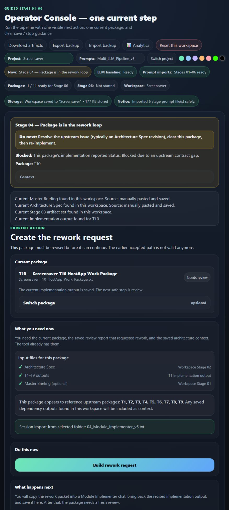
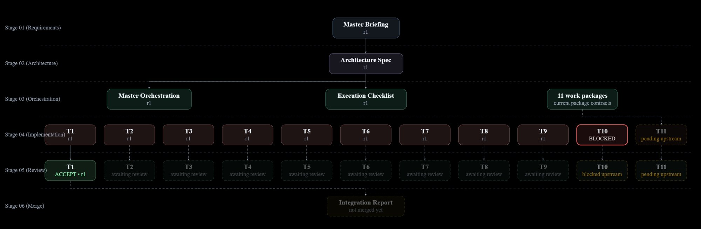
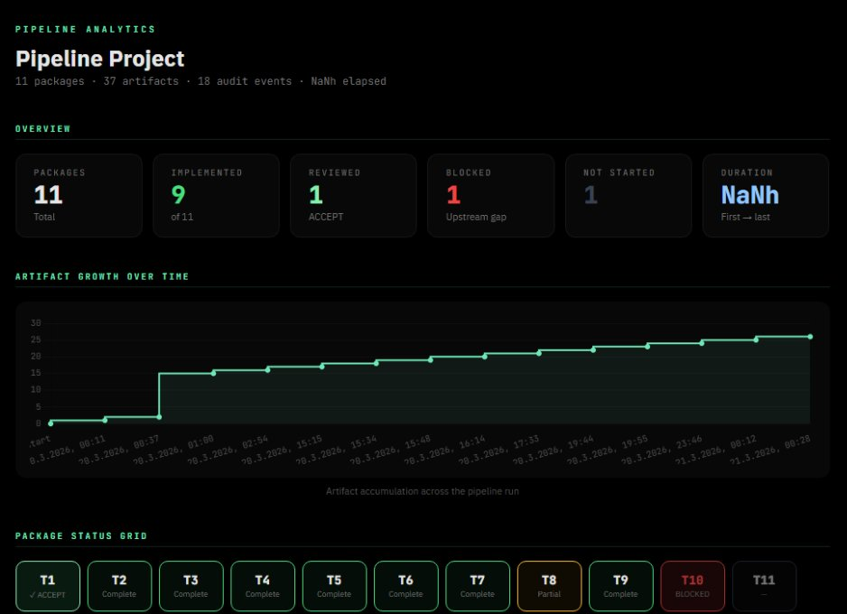

# Multi-LLM Coding Pipeline

**A rigid, inspectable scaffold that forces LLMs through contract-bound stages instead of letting them improvise.**

MIT License · Zero dependencies · Fully offline · No backend, no accounts, no telemetry · Requires a Chromium-based browser (Chrome, Edge, or Brave)

---

## What this is

A structured multi-stage workflow that splits LLM-assisted work into six stages with frozen contracts, mandatory review gates, and traceable artifacts. A human operator sits between every stage, routing work to the most suitable model and verifying outputs against explicit acceptance criteria.

It is not an autonomous agent. It is the opposite — a system that treats LLMs as unreliable workers who produce dramatically better results when given clear boundaries, explicit contracts, and external verification.

## What problem it solves

Long LLM sessions drift. Requirements mutate silently. Models invent assumptions they never state. When something breaks at step 40, you cannot tell whether the error was introduced at step 3 or step 37. There is no audit trail, no contract, no way to verify what was agreed versus what was delivered.

This pipeline eliminates that failure mode by enforcing:

- **Separation of concerns.** The model that defines requirements is not the model that implements them, is not the model that reviews them.
- **Contract closure before execution.** Nothing gets built until the structural rules are frozen and explicitly accepted.
- **Traceable artifacts.** Every stage produces a named, versioned, fingerprinted artifact. Every review is bound to the exact version it reviewed.
- **Controlled repair.** When something fails, exactly one package gets reworked — not the entire project regenerated from scratch.

## What this looks like in practice

In a real project (a Windows multi-monitor video screensaver, 11 packages), the Architecture Spec defined an interface `assess_media()` returning a simple pass/fail capability assessment. During implementation, Package T10 needed full media probe data — codec, HDR status, duration — that the interface did not provide.

**In a normal long chat:** The model would silently invent the missing fields, or restructure the interface to fit. You would discover the inconsistency days later during integration.

**In this pipeline:** The implementer correctly reported `Status: Blocked` because the Work Package Contract explicitly listed which interfaces it was allowed to consume. The Console showed T10 as blocked, downstream packages were marked pending, and the fix was a targeted Architecture Spec revision — one interface change, two packages re-implemented, everything else untouched.

The scaffold did not prevent the specification gap. It made the gap visible at the exact point where it mattered, with a clear path to resolution.

## What is included

| Component | Description |
|---|---|
| **Operator Console** | Browser-based control center (single HTML + JS modules). Tracks state, manages artifacts, enforces workflow, renders dependency graphs. Zero install — double-click and go. |
| **6 Coding Prompts** | Battle-tested prompt set for software development projects. The reference implementation. |
| **6 Domain-Agnostic Templates** | Generic versions with `[DOMAIN:]` markers for any field — book manuscripts, structural engineering, legal documents, policy writing. |
| **Pipeline Prompt Compiler** | Meta-prompt that adapts the templates to a new domain. |
| **Pipeline Prompt Validator** | Deterministic HTML tool that audits compiled prompts for structural completeness and Console compatibility. Includes auto-repair for fixable issues (missing tags, section stubs, residual markers) and per-finding or fix-all workflows with repaired file download. |
| **Pipeline Protocol** | Single-source-of-truth JSON file (`pipeline_protocol_v1.json`) defining all frozen tokens, required sections, contract ID prefixes, escalation patterns, greeting patterns, cross-prompt handoff checks, and stage metadata. Consumed by the Validator at runtime; can be hot-swapped via the UI. |
| **Conformance Fixtures** | Minimal test prompts (valid and invalid) for regression-testing the Validator after protocol or prompt changes. |
| **Pipeline Analytics Dashboard** | Interactive visualization of project data — artifact timeline, package status, audit event distribution. Standalone HTML, offline, exportable. |

## Who this is for

- **Solo developers** doing long, brittle coding sessions where a single wrong assumption cascades into hours of rework.
- **Users of smaller local models** (7B–70B) that benefit most from rigid structure and explicit contracts.
- **Privacy-sensitive or air-gapped environments** where sending data to cloud APIs is not an option.
- **Teams that want inspectable handoffs** instead of autonomous agent chaos — where knowing *why* something was built matters as much as *what* was built.
- **Non-programmers** who orchestrate LLM work and need discipline without writing code.

## The six stages

```
Stage 01          Stage 02            Stage 03             Stage 04          Stage 05          Stage 06
Requirements  →   Architecture    →   Orchestration    →   Implementation →  Review        →   Integration
Engineer          Architect           Orchestrator         Author             Reviewer          Coordinator

   ↓                 ↓                   ↓                    ↓                 ↓                 ↓
Master            Architecture       Work Packages        Deliverables      Review Report     Integration
Briefing          Spec               + Execution          + Delivery        + ACCEPT/REWORK   Report
                  + Frozen           Checklist            Report                              + Merge Verdict
                  Contracts
```

Each arrow is a human checkpoint. The operator reads, verifies, and decides whether to proceed or escalate. No stage runs automatically.

**→ See [QUICKSTART.md](QUICKSTART.md) for a complete 15-minute walkthrough with a real 3-package project.**

## Why no dependencies

The Console is a single HTML file with 10 JavaScript modules. No npm, no build step, no framework, no server. It runs from a local folder in any modern browser.

This is intentional:

- **No hidden fetch calls.** The Console never contacts any server. Your data stays on your machine.
- **No trust surface.** There is nothing to audit except the files you can read. No minified bundles, no transitive dependencies, no supply chain risk.
- **Offline by default.** The hardened version works fully air-gapped. Even the analytics dashboard has Chart.js inlined.
- **Trivially portable.** Copy the folder. That's deployment.

The Pipeline Analytics Dashboard is equally self-contained: one HTML file, 227KB, zero CDN dependencies.

## What the Console actually does

The Console is not a clipboard manager. It is the operational backbone:

- **Artifact tracking.** Every artifact gets a unique ID, revision number, content fingerprint, creation timestamp, and parent lineage.
- **Stage enforcement.** The workflow state machine prevents skipping stages or submitting work to the wrong gate.
- **Manifest maintenance.** A machine-readable `artifact_manifest.json` tracks every artifact ever produced, its status (current/superseded/missing), and its relationships.
- **Audit logging.** Every operator action is recorded in `audit_log.ndjson` — append-only, timestamped, machine-parseable.
- **Review binding.** A cryptographic fingerprint ties each review to the exact implementation version it evaluated. If the implementation changes, the review is automatically marked stale.
- **Dependency graph.** Interactive SVG visualization showing all artifacts, their lineage, blocked packages, and cascading invalidation.
- **Plausibility checks.** Content validation before every save — wrong-stage markers, missing keywords, truncation detection.
- **Domain pack switching.** Hot-swap between pre-compiled prompt sets (coding, legal, book) via a `prompts/` folder.

## Screenshots

| Console — guided workflow with rework routing | Lineage graph — T10 blocked, downstream pending |
|---|---|
|  |  |

| Analytics Dashboard — package status, audit events, activity timeline |
|---|
|  |

## What a workspace looks like on disk

After a pipeline run, the workspace folder contains everything needed to reconstruct the full project history:

```
my-project/
├── stage01/
│   └── master_briefing_r1.txt
├── stage02/
│   └── architecture_spec_r1.txt
├── stage03/
│   ├── master_orchestration_r1.txt
│   ├── WP01_core_module_Work_Package.txt
│   ├── WP02_parser_Work_Package.txt
│   └── WP03_cli_Work_Package.txt
├── stage04/
│   ├── WP01_implementation.txt
│   ├── WP02_implementation.txt
│   └── WP03_implementation.txt
├── stage05/
│   ├── WP01_review_report.txt
│   ├── WP02_review_report.txt
│   └── WP03_review_report.txt
├── stage06/
│   └── integration_report_r1.txt
├── artifact_manifest.json        ← every artifact, its fingerprint, revision, status, lineage
├── audit_log.ndjson              ← append-only log of every operator action with timestamps
├── workspace_state.json          ← current pipeline state, stage positions, review bindings
└── prompts/
    └── coding/
        ├── 01_Requirements_Engineer.txt
        └── ...
```

The manifest and audit log are machine-readable. Nothing is hidden in browser storage — if you lose the Console, the workspace folder is the complete record.

## What reproducibility means here

This scaffold provides:

- **Reproducible process shape.** Every run follows the same stages, the same contracts, the same review gates.
- **Reproducible artifacts.** Every output has a named type, a version, a fingerprint, and traceable parent artifacts.
- **Inspectable runs.** The audit log and manifest make it possible to reconstruct exactly what happened, when, and why.

It does **not** provide identical model outputs. LLMs are non-deterministic. The same prompt with the same model will produce different text. The scaffold makes the *process* deterministic, not the *content*.

## Failure terms

To avoid misunderstanding, here is what specific terms mean in this project:

| Term | Definition |
|---|---|
| **Requirement drift** | The project's goals silently change between stages because no frozen contract enforces the original intent. |
| **Role drift** | A model tasked with implementation starts making architectural decisions, or a reviewer starts redesigning instead of verifying. |
| **Assumption creep** | A model fills gaps in the specification with unstated assumptions that downstream stages inherit as fact. |
| **Fabricated details** | A model invents specific technical details (function signatures, data formats, API contracts) that were never specified. |
| **Contract breakage** | A deliverable violates a frozen contract from the Architecture Spec — wrong interface, wrong dependency direction, wrong shared definition. |

The scaffold does not prevent hallucination. It makes hallucination **inspectable** — caught at review gates instead of discovered after integration.

## When this is too much

This scaffold adds ceremony. For a 20-line script or a quick prototype, it is overkill.

Use the full pipeline when:

- The task has 3+ interacting components
- The cost of errors is high (hours of rework, not minutes)
- You need to prove what was built matches what was specified
- You are using models that drift when given long, loosely structured prompts

A lighter mode (single-pass, no decomposition) is possible for simpler tasks. The Requirements Engineer's Complexity Assessment explicitly recommends "SINGLE PASS SUFFICIENT" when appropriate.

## Honest limitations

- **A wrong early artifact can poison downstream work.** Rigidity preserves decisions — including bad ones. The review and validation gates exist to catch errors earlier, not to pretend that structure makes wrong inputs right.
- **Overhead scales with project size.** 11 packages means 11 implementations, 11 reviews, and a merge pass. For small projects, this is expensive.
- **The operator is the weakest link.** If the human rubber-stamps a review without reading it, the scaffold cannot help.
- **Model quality still matters.** The scaffold makes bad models fail more visibly, but it does not make them competent.

## Built with this pipeline

| Project | Packages | Models Used | Notes |
|---|---|---|---|
| **BrickGen** — CLI tool converting STL files to LEGO-compatible brick models with PDF build instructions | 7 | Claude (architecture, review), ChatGPT (implementation) | MVP completed through full pipeline lifecycle including rework cycles |
| **Windows Multi-Monitor Video Screensaver** | 11 | Claude, ChatGPT, Gemini | Largest project to date; surfaced a real interface specification gap caught at the Blocked-State gate (see example above) |
| **Pipeline Operator Console** | Self-hosted | Claude, ChatGPT | The Console was rebuilt through its own pipeline — the scaffold producing its own tooling |

## Project status

This is a **personal toolkit shared publicly**. It is actively maintained and used in production by its author. Community contributions are welcome (see CONTRIBUTING.md), but response times may vary.

| Component | Status |
|---|---|
| Operator Console | Stable. Used daily in multi-project workflows. |
| Coding Prompts (6) | Stable. Battle-tested across multiple projects. |
| Domain-Agnostic Templates | Stable. Tested via Prompt Compiler + Validator. |
| Prompt Compiler v2 | Stable. |
| Prompt Validator | Stable. Protocol-driven with auto-repair and conformance fixtures. |
| Pipeline Protocol v1 | Stable. Validator-verified against v5 prompts. |
| Analytics Dashboard | Stable. |
| Hardened Console | Stable. Air-gap tested. |

## Roadmap

**Current scope:**
- Full 6-stage pipeline with operator console
- Multi-model routing (Claude, ChatGPT, Gemini, local models)
- Domain-agnostic templates for any field
- Offline analytics and validation tooling
- Quickstart worked example (minimal 3-package project)
- Pipeline Protocol as single source of truth for prompt validation

**Next improvements:**
- Partial/clustered merge for large projects
- Normalized uncertainty reporting (each stage outputs assumptions, unknowns, unresolved decisions)
- Community-contributed domain packs
- Rework-counter metrics in Analytics Dashboard (per-package 04→05→04 ping-pong tracking)
- Console validation against Pipeline Protocol schemas

**Intentionally not in scope (yet):**
- Autonomous agent mode (the human-in-the-loop is the point)
- Cloud sync or multi-user collaboration
- Model API integration (the Console is model-agnostic by design)

## License

MIT License. See [LICENSE](LICENSE) for full text. Use it, fork it, adapt it, sell products built with it. Attribution appreciated but not required.
